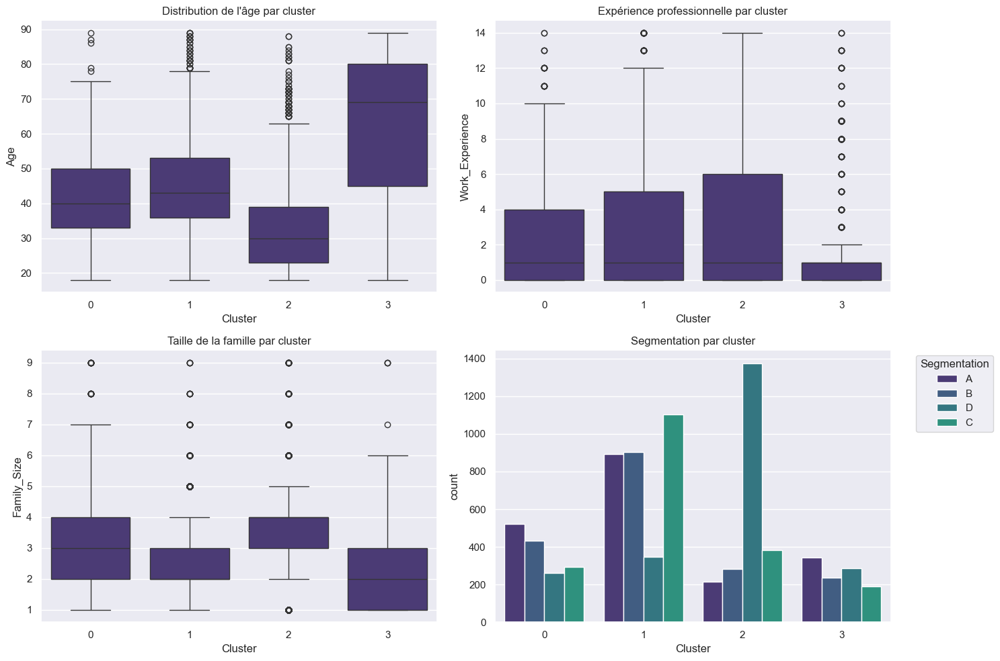

# Clustering_Reduction_Dimensions
Projet : Clustering et Réduction de Dimensions

## Contexte
Le clustering permet de segmenter des données en groupes
homogènes, utile pour la segmentation des clients.

## Objectifs
- Appliquer des techniques de clustering
- Utiliser des techniques de réduction de dimension pour visualiser les clusters

## Problématiques

En Marketing : Comment segmenter les clients en fonction de leurs
comportements d'achat ?

- Dataset : [https://www.kaggle.com/datasets/kaushiksuresh147/customersegmentation](https://www.kaggle.com/datasets/kaushiksuresh147/customersegmentation)

## Technologies Utilisées

-Python : Scikit-learn (KMeans, PCA), t-SNE

## Compétences à Acquises
- Clustering et réduction de dimension : Application des techniques de clustering et de réduction de dimension avec des algorithmes comme KMeans, CAH, DBSCAN PCA, et t-SNE. Analyse statistique des résultats
- Visualisation des clusters : Utilisation de visualisations interactives pour mieux comprendre les résultats des clusters.
